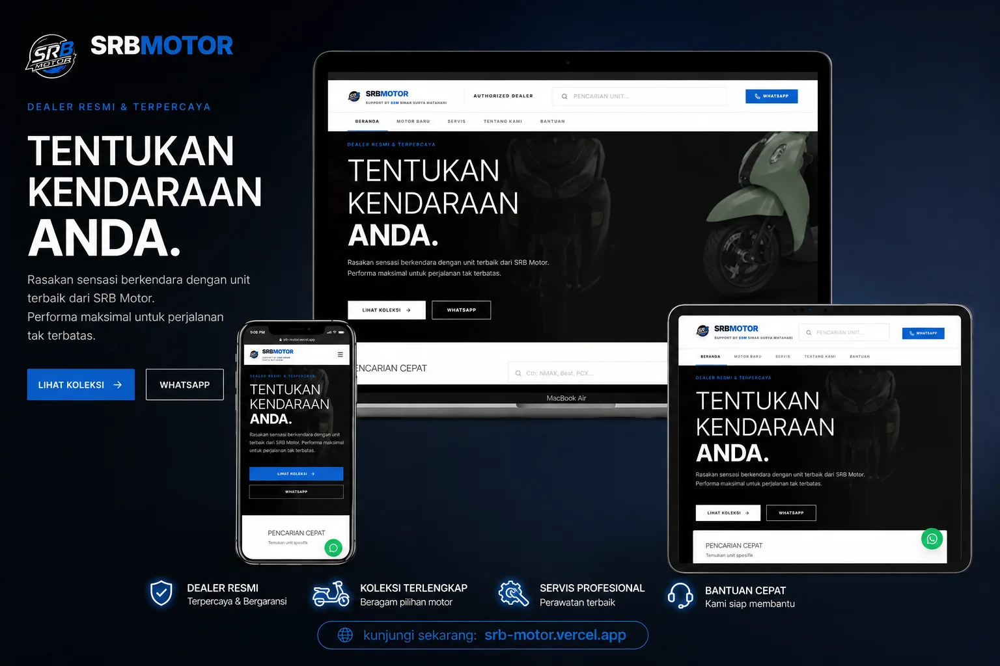

# SRB Motor - Showroom Digital (Frontend-Only / Static Version)

<div align="center">
  
  <p><b>Showroom Digital & Katalog Resmi Dealer Motor Baru Honda & Yamaha Bekasi</b></p>
  
  [](https://nextjs.org)
  [](https://typescriptlang.org)
  [](https://tailwindcss.com)
  [](https://srb-motor.vercel.app/)
</div>

---

## 📢 Tampilan Showroom Digital Baru



---

## ⚡ Perbedaan Versi: Frontend-Only vs Full-Stack

Proyek ini adalah versi **Frontend-Only / Static Website** dari SRB Motor. Berikut adalah perbedaan utamanya dengan versi **Full-Stack (Laravel-Inertia)**:

| Fitur | Versi Frontend-Only (Next.js) 🌐 | Versi Full-Stack (Laravel-Inertia) 💻 |
| --- | --- | --- |
| **Teknologi Utama** | Next.js (App Router), React, TypeScript | Laravel, Inertia.js, React, MySQL |
| **Manajemen Data** | Data Motor lokal statis (`lib/motor-data.ts`) | Dinamis menggunakan Database MySQL (CRUD via Admin Panel) |
| **Transaksi Pembelian** | Pengajuan Cash/Kredit diarahkan langsung ke **WhatsApp** | Pemrosesan terintegrasi di sistem dengan unggah dokumen |
| **Pembayaran Booking Fee** | Diarahkan ke WhatsApp sales | Otomatis terintegrasi payment gateway (Midtrans) |
| **Pemesanan Servis** | Formulir Booking mengirimkan tiket pendaftaran langsung ke WhatsApp | Booking terjadwal dan disimpan di database |
| **Autentikasi & Akun** | Tanpa Login (seluruh fitur publik instan tanpa akun) | Login, Register, Manajemen Profil, & Riwayat Transaksi |
| **Dashboard Admin** | Tidak ada | CRUD Motor, approval kredit, ekspor laporan PDF/Excel, dll. |

---

## Getting Started

Jalankan server pengembangan:

```bash
npm run dev
```

Buka [http://localhost:3000](http://localhost:3000) di browser untuk melihat hasilnya.

## Build untuk Produksi

```bash
npm run build
```

Aplikasi akan dikompilasi dan mengoptimasi berkas static untuk siap di-deploy (misalnya ke Vercel).
